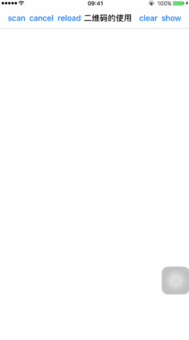

# SYBarcodeManager
二维码操作封装类
* 二维码
  * 扫描二维码
  * 生成二维码
* 条形码
  * 生成条形码

* 扫描二维码
# 代码示例
~~~ javascript
#import "SYBarcodeManager.h"
~~~

~~~ javascript
// 实例化
self.scanningBarcode = [[SYBarcodeManager alloc] initWithFrame:self.view.bounds view:self.view];

// 属性设置
self.scanningBarcode.maskColor = [UIColor orangeColor];
self.scanningBarcode.scanlineColor = [UIColor redColor];
self.scanningBarcode.scanCornerColor = [UIColor greenColor];
self.scanningBarcode.scanFrame = CGRectMake(60.0, 100.0, 80.0, 80.0);

// 开始扫描
[self.scanningBarcode barcodeScanningStart:^(NSString *scanResult) {
        NSLog(@"scanResult = %@", scanResult);
        [[[UIAlertView alloc] initWithTitle:nil message:scanResult delegate:nil cancelButtonTitle:nil otherButtonTitles:@"ok", nil] show];
}];

// 结束扫描
[self.scanningBarcode barcodeScanningCancel];
~~~

# 扫描二维码效果图

 

* 生成用户自定义内容的二维码，可以自定义颜色和大小。

# 代码示例
~~~ javascript
#import "SYBarcodeManager.h"
~~~

~~~ javascript
// 方法1 用户自定义颜色
UIImage *image = [SYBarcodeManager barcodeImageWithContent:@"https://github.com/potato512/BarcodeManager" size:200.0 colorRed:10.0 colorGreen:100.0 colorBlue:50.0];
// 方法2 黑色颜色
UIImage *image = [SYBarcodeManager barcodeImageWithContent:@"https://github.com/potato512/BarcodeManager" size:200.0];
~~~

# 生成二维码效果图

 

# 修改完善
* 20181016
  * 版本号：2.0.2
  * 功能完善
    * 扫描线条改成图标
    * 扫描线条动画改成上下往返
    
* 20180918
  * 版本号：2.0.1
  * 功能添加
    * 条形码生成
    
* 20171020
  * 版本号：2.0.0
  * 功能优化
    * 扫描方法优化
    * 属性设置优化
    * 扫描界面优化

* 20170922
  * 版本号：1.1.0
  * 新增功能属性
    * 停止扫描后重新开始扫描
    * 扫描线属性

~~~ javascript
/// 重新开始扫描
- (void)barcodeScanningStart;

/// 是否显示扫描线，默认NO不显示
@property (nonatomic, assign) BOOL showScanline;
/// 扫描线颜色，默认灰色
@property (nonatomic, strong) UIColor *scanlineColor;
/// 是否显示角线，默认NO不显示
@property (nonatomic, assign) BOOL showScanCorner;
/// 角线颜色，默认黑色
@property (nonatomic, strong) UIColor *scanCornerColor;
/// 扫描线动画时间，默认1.6秒
@property (nonatomic, assign) NSTimeInterval scanTimeDuration;
/// 圆角，默认方角
@property (nonatomic, assign) CGFloat scanRadius;

~~~

* 20170921
  * 版本号：1.0.0
  * 源码与Demo分离

